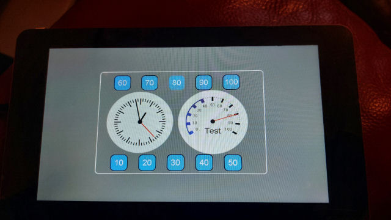

 
I've updated this example to use ESPHome 2025.11.0 - incorporating the work of <a target="_blank" href="https://community.home-assistant.io/t/waveshare-esp32-s3-touch-lcd-7/789584/90?u=derham">gingermist</a> and <a target="_blank" href="https://community.home-assistant.io/u/andrew_NH">andrew_NH</a>
  
good luck
 
 
The image below shows the example included.
The buttons 10-100 resets the Test meter to that value. Touching the meter resets it to zero. Touching the clock displays a simple message box.
That's it. Enjoy.   
  
Tested using... 
Core: 2024.12.5 
Supervisor: 2024.12.0 
Operating System: 14.1 
Frontend: 20241127.8 
 
I've also uploaded this <a target="_blank" href="https://github.com/DMonkey-hub/esphome/tree/main/examples/ESP32-S3-Touch-LCD-7">test</a> example using the <a target="_blank" href="https://www.waveshare.com/wiki/ESP32-S3-Touch-LCD-7">ESP32-S3-Touch-LCD-7</a> device in case it helps others.  
I've updated this example to use ESPHome 2025.7.2 - there was a lot broken during the last 6 months
  
  
